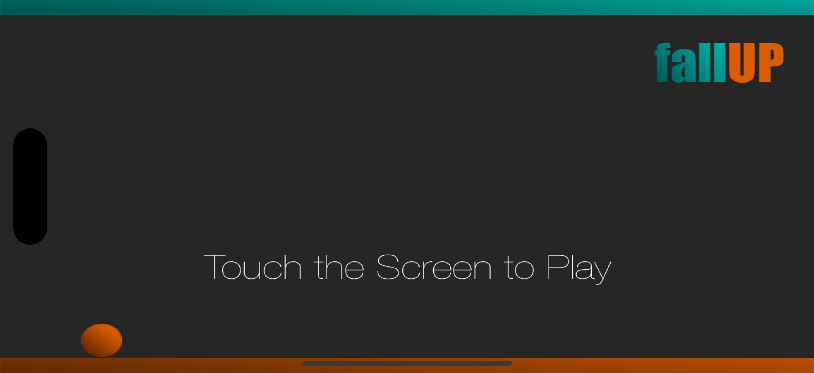
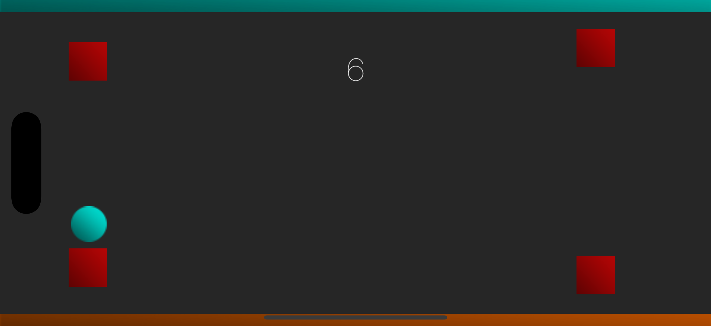
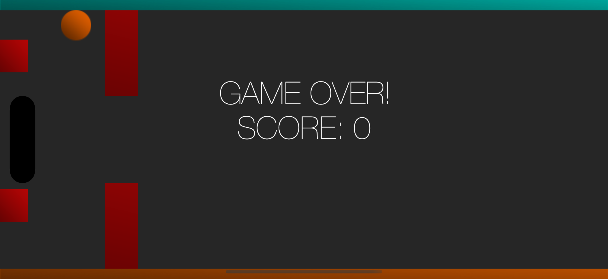

# FallUP 🎮

A simple arcade game where you control a bouncing ball through increasingly challenging obstacles by switching gravity direction!


## 🎯 Game Overview

FallUP is an engaging arcade-style mobile game that challenges players to navigate a bouncing ball through a series of obstacles by strategically switching gravity direction. The game combines simple controls with increasingly complex gameplay mechanics, making it easy to learn but challenging to master.

## ✨ Features

- **Gravity Switching Mechanics**: Tap or let the ball touch the floor/ceiling to reverse gravity and navigate through obstacles
- **Dynamic Obstacle Generation**: Randomly generated obstacles that increase in difficulty with your score
- **Smooth Physics**: Built with SpriteKit for responsive and realistic ball physics
- **Progressive Difficulty**: Challenge increases as you progress, keeping gameplay engaging
- **Clean, Modern UI**: Minimalist design with vibrant teal and orange color scheme
- **Touch Controls**: Simple one-tap controls perfect for mobile gaming

## 🎮 How to Play

1. **Start the Game**: Touch the screen on the title screen to begin
2. **Control the Ball**: Tap anywhere on the screen to switch gravity direction
3. **Navigate Obstacles**: Avoid red bombs and black walls while collecting points
4. **Score Points**: Pass through invisible scoring zones to increase your score
5. **Survive**: The longer you survive, the higher your score and the more challenging the obstacles become

## 🖼️ Screenshots

### Title Screen


### Gameplay

*Navigate the ball through obstacles by switching gravity*

### Game Over

*The game is over when the ball touches the red block or the red wall*

## 🛠️ Technical Details

- **Platform**: iOS 15.0+
- **Language**: Swift 6.0
- **Framework**: SpriteKit + GameplayKit
- **Architecture**: MVC pattern with SpriteKit scenes
- **Physics Engine**: Built-in SpriteKit physics with custom collision detection
- **Target Devices**: iPhone and iPad (Landscape orientation)

## 🚀 Installation

### Prerequisites
- Xcode 16.0 or later
- iOS 15.0+ deployment target
- macOS 12.0+ (for development)

### Build Instructions
1. Clone the repository:
   ```bash
   git clone https://github.com/yourusername/FallUP_V2.git
   cd FallUP_V2
   ```

2. Open the project in Xcode:
   ```bash
   open FallUP.xcodeproj
   ```

3. Select your target device or simulator

4. Build and run the project (⌘+R)

## 🏗️ Project Structure

```
FallUP_V2/
├── FallUP/
│   ├── GameScene.swift          # Main gameplay logic
│   ├── loadScene.swift          # Title/loading screen
│   ├── GameViewController.swift # Main view controller
│   ├── AppDelegate.swift        # App lifecycle management
│   ├── Assets.xcassets/         # Game images and icons
│   ├── GameScene.sks            # Main scene file
│   └── loadScene.sks            # Loading scene file
└── FallUP.xcodeproj/            # Xcode project file
```

## 🎨 Game Assets

The game uses a carefully crafted set of visual elements:
- **Ball Sprites**: Blue and orange variants for different gravity states
- **Obstacles**: Red bombs and black rectangular walls
- **UI Elements**: Clean, modern interface with teal and orange accent colors
- **Backgrounds**: Dark gray theme for optimal contrast and focus

## 🔧 Customization

### Modifying Game Difficulty
Adjust the difficulty by modifying values in `GameScene.swift`:
- `bombSize` and `badWallSize` for obstacle dimensions
- Spawn timing in the `spawnEnemyObjects()` method
- Gravity strength in `changeBallGravity()`

### Adding New Obstacles
1. Add new obstacle images to `Assets.xcassets`
2. Modify the `spawnEnemies()` method in `GameScene.swift`
3. Update collision masks if needed

### Changing Visual Style
- Modify colors in the scene setup methods
- Replace asset images in `Assets.xcassets`
- Adjust UI positioning and sizing

## 🐛 Known Issues

- None currently reported

## 🚧 Future Enhancements
- [ ] Sound effects and background music
- [ ] Power-ups and special abilities
- [ ] Level-based progression system
- [ ] Particle effects and visual polish

